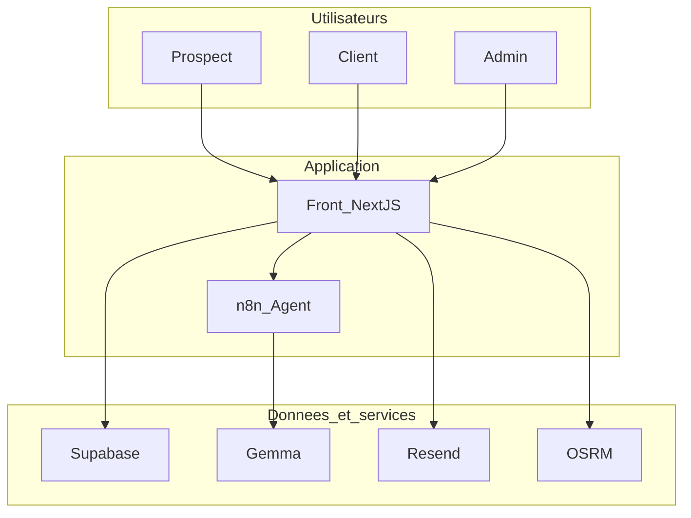
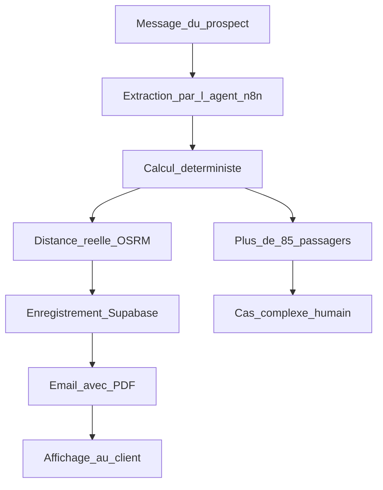

# Autocar Location — Documentation technique

> But de ce document : permettre à **n'importe quel développeur** de comprendre le
> projet **rapidement**, de savoir **où se trouve quoi**, et **où modifier quoi**.
> Projet étudiant Epitech (MBA). Toutes les explications sont volontairement simples.

---

## 1. En une minute

Application qui **automatise le cycle commercial** d'un intermédiaire en transport de
groupe en autocar :

**Lead** (le client décrit son besoin en chat) → **qualification** par un agent IA →
**devis chiffré automatiquement** (règles déterministes, pas l'IA) → **email + PDF** →
**relances automatiques** → **dashboard de pilotage** pour l'équipe commerciale.

> ⭐ **Règle d'or** : l'IA **comprend et oriente**, mais le **prix vient toujours du code
> déterministe** (`calculerDevis`), **jamais** du modèle de langage. C'est reproductible
> et auditable.

---

## 2. Architecture



- **Front Next.js** (`web/`) : pages publiques + chat, espace client, dashboard admin, et **toutes les routes serveur** (`/api/*`) qui contiennent la logique métier.
- **n8n** (`n8n/`) : l'agent IA. **Un seul appel LLM** (Gemma) qui **extrait** les paramètres (JSON) ; ensuite un nœud **Code** (miroir du moteur) **calcule le devis** ET **génère la réponse** au client de façon **déterministe**. Choix volontaire : plus rapide (tient dans le timeout serverless), pas de « fuite de raisonnement », moins d'appels = moins d'erreurs 503.
- **Supabase** : PostgreSQL + Auth (email/mot de passe) + RLS (cloisonnement par utilisateur).
- **Services gratuits** : Gemma (LLM, via Google AI Studio), Resend (emails), OSRM/Nominatim (distance routière réelle).

---

## 3. Stack & versions

| Brique | Techno |
|--------|--------|
| Front | Next.js 16 (App Router, Turbopack), React 19, TypeScript, Tailwind v4 |
| Icônes | lucide-react |
| Base & Auth | Supabase (PostgreSQL + RLS) |
| Agent IA | n8n (self-hosted) + Gemma (`gemma-4-31b-it`) |
| PDF | pdf-lib | 
| Emails | Resend |
| Distance | OSRM + Nominatim (sans clé) |
| Tests | Vitest (front) + `node:test` (moteur de prix) |

---

## 4. Arborescence commentée

```
racine/
├─ pricing/                 Moteur de devis déterministe (Node, SOURCE DE VÉRITÉ)
│  ├─ matrices.js           Le barème (grille, saison, capacité, marge, TVA…)
│  ├─ calculer_devis.js     L'algorithme de calcul
│  ├─ n8n-code-node.js      Le même calcul, copié dans le nœud Code de n8n
│  └─ *.test.js             Tests du moteur (npm test)
│
├─ n8n/                     L'agent IA
│  ├─ build-workflow.js     Génère agent-workflow.json (prompts + nœuds)
│  ├─ agent-workflow.json   Workflow à importer dans n8n
│  └─ relances-workflow.json Workflow planifié qui appelle /api/relances
│   (prompts générés par build-workflow.js)
│
├─ supabase/                Base de données
│  ├─ schema.sql            Tables + enums + RLS + barème (référence)
│  ├─ reset-complet.sql     Tout recréer + jeu de données propre
│  ├─ reset-demo.sql        Réinitialiser les données de démo (avant une démo)
│  ├─ ajout-prenom.sql      Migration non destructive (colonnes récentes)
│  └─ SCHEMA.md             Schéma expliqué (mermaid + chaque table)
│
└─ web/                     L'application Next.js
   ├─ app/
   │  ├─ page.tsx           Landing (hero, chat, avis, CTA)
   │  ├─ layout.tsx         Header + Footer + ChatWidget globaux
   │  ├─ login/             Connexion / inscription / mot de passe oublié
   │  ├─ reset-password/    Définir un nouveau mot de passe
   │  ├─ espace-client/     Portail client (devis, compte, conversations)
   │  ├─ admin/             Dashboard de pilotage commercial
   │  ├─ contact/           Formulaire de contact
   │  ├─ devis/refuser/     Page publique de refus (lien tokenisé)
   │  ├─ mentions-legales/  + confidentialite/  (RGPD, projet étudiant)
   │  ├─ components/        Header, Footer, Chat, ChatWidget, StatutBadge, Spinner
   │  └─ api/               LOGIQUE MÉTIER (voir §7)
   └─ lib/                  Fonctions réutilisables + tests (voir §6)
```

---

## 5. Le flux d'un devis, pas à pas



1. Le prospect écrit dans le **chat** (`components/Chat.tsx`).
2. Le front appelle **`/api/chat`**, qui relaie la conversation à **n8n**.
3. n8n **extrait** les paramètres (1 appel LLM) ; le nœud **Code** calcule le devis **et** rédige la réponse (déterministe).
4. De retour dans `/api/chat`, on **recalcule** avec la **distance routière réelle** (OSRM) — le 1ᵉʳ prix est ensuite **figé**.
5. On **persiste** conversation + demande + devis dans Supabase, et on **envoie l'email** (PDF joint) si l'email est connu.
6. Si **> 85 passagers** → pas de devis automatique : la demande devient **`cas_complexe`** (un conseiller la chiffre à la main via le dashboard).

---

## 6. Modules `web/lib/` (le cœur réutilisable)

| Fichier | Rôle |
|---------|------|
| `calculerDevis.ts` | **Moteur de prix déterministe** (port TS de `pricing/`). Le prix officiel. Testé. |
| `distance.ts` | Distance routière réelle via Nominatim (géocodage) + OSRM (itinéraire). |
| `devisPdf.ts` | Génère le **PDF de devis/facture** (pdf-lib) : logo, réf. stable, adresse, totaux. |
| `emailDevis.ts` | **Gabarit HTML** de l'email (vue client : prix HT/TVA/TTC, boutons accepter/refuser). |
| `relances.ts` | Logique de **relances** (J+2/J+3/J+7, max 2) et d'**expiration** (30 j). Testé. |
| `supabaseClient.ts` | Client Supabase **navigateur** (clé anon, soumis à la RLS). |
| `supabaseAdmin.ts` | Client Supabase **serveur** (service role, contourne la RLS — jamais exposé au navigateur). |
| `useAuth.ts` | Hook React : session courante + rôle (client/admin). |

---

## 7. Routes serveur `web/app/api/` (toute la logique métier)

| Route | Rôle | Qui peut l'appeler |
|-------|------|--------------------|
| `chat` | Relaie à n8n, recalcule (OSRM), persiste, envoie l'email | Public (capture de lead) |
| `relances` | Traite les relances dues + expire les vieux devis | Secret cron **ou** admin |
| `admin-data` | KPIs + pipeline + demandes détaillées | Admin |
| `my-data` | Devis + conversations + profil du client connecté | Client (token) |
| `me` | Profil léger (email/rôle/nom) ; crée la fiche à la 1ʳᵉ connexion | Utilisateur (token) |
| `devis-pdf` | Renvoie le PDF d'un devis | Admin **ou** propriétaire |
| `devis-reponse` | Accepter / refuser son devis (+ motif de refus) | Propriétaire (token) |
| `devis-refuser-public` | Refuser **sans compte** via le token reçu par email | Token (capability) |
| `demande-statut` | Marquer gagné / perdu / pris en charge | Admin |
| `devis-manuel` | Devis sur-mesure pour un cas complexe (rejoint le pipeline) | Admin |
| `profil-update` | Met à jour les coordonnées (adresse de facturation) | Client (token) |
| `contact` | Envoie le message du formulaire à `contact@am-creative.fr` | Public |

**Principe de sécurité** : le navigateur n'a que la clé **anon** (limitée par RLS). Les
routes serveur qui doivent tout voir utilisent la **service role key** (jamais envoyée au
client) **après avoir vérifié le token et le rôle**.

---

## 8. Le moteur de prix (`pricing/` & `calculerDevis.ts`)

Calcul, dans l'ordre :
1. **Base** : forfait selon la grille si distance ≤ 180 km, sinon longue distance (`km × 2 × 2,5 €`).
2. **Aller-retour** : base × 2.
3. **Coefficients additifs** : saison du mois + anticipation (jours avant départ) + capacité (nb passagers).
4. **Marge** +15 %, puis **TVA** 10 %.
5. **Escalade** si nb passagers > 85 → renvoie `{ escalade }` (intervention humaine).

Le barème est dans **`matrices.js`** (et en base dans `pricing_config`) : on peut changer
un tarif **sans toucher à l'algorithme**.

---

## 9. Base de données

Voir **`supabase/SCHEMA.md`** (diagramme + description de chaque table/relation).
Tables : `profiles`, `clients`, `demandes`, `devis`, `relances`, `conversations`, `pricing_config`.
RLS activée partout : un client ne lit que **ses** lignes.

---

## 10. Lancer, tester, déployer

```bash
# Moteur de prix (aucune clé)
npm install && npm test            # à la racine

# Base : exécuter supabase/reset-complet.sql dans Supabase (SQL Editor)

# Front
cd web
cp .env.local.example .env.local   # remplir les clés
npm install
npm run dev                        # http://localhost:3000
npm run build && npx vitest run    # build + 26 tests

# Agent : importer n8n/agent-workflow.json + n8n/relances-workflow.json dans n8n
```

- Clés à brancher : **`web/.env.local.example`** (Supabase, n8n, Resend, `CRON_SECRET`, `NEXT_PUBLIC_SITE_URL`)
- Déploiement (Vercel + n8n) : **`DEPLOIEMENT.md`**
- En un clic (Windows) : **`start.bat`**

---

## 11. « Où je modifie quoi ? » (antisèche)

| Je veux… | Fichier(s) |
|----------|-----------|
| Changer un **tarif** / la TVA / la marge | `pricing/matrices.js` + table `pricing_config` (+ `web/lib/calculerDevis.ts` qui en est le miroir) |
| Changer la **règle d'escalade** (85 pax) | `seuil_escalade_passagers` dans les matrices |
| Changer la **cadence des relances** | `web/lib/relances.ts` |
| Modifier l'**extraction** ou la **réponse** de l'agent | `n8n/build-workflow.js` (prompt d'extraction + texte de réponse du nœud Code) puis régénérer |
| Changer le **design** / les couleurs | `web/app/globals.css` (variables CSS) |
| Ajouter une **page** | `web/app/<nom>/page.tsx` |
| Ajouter une **règle métier serveur** | `web/app/api/<nom>/route.ts` |
| Modifier l'**email** du devis | `web/lib/emailDevis.ts` |
| Modifier le **PDF** | `web/lib/devisPdf.ts` |
| Changer le **jeu de données démo** | `supabase/reset-demo.sql` |

---

## 12. Documentation générée automatiquement

Deux références **interactives** complètent ce document :

- **API (Swagger UI)** — lance le front puis ouvre **`/docs`** (ex. `http://localhost:3000/docs`).
  Explorateur de **toutes les routes** (`web/app/api/*`) : corps attendu, réponses, autorisations.
  La source est `web/public/openapi.yaml`.
- **Code (TypeDoc, façon Javadoc)** — `cd web && npm run doc`, puis ouvre `web/docs/index.html`.
  Référence HTML auto-générée à partir du code TypeScript et des commentaires JSDoc de `web/lib/`.

## 13. Conventions de code

- **Un commentaire en tête de chaque fichier** explique son rôle (lire le haut du fichier = comprendre le fichier).
- TypeScript strict côté front ; fonctions métier **pures et testées** isolées dans `web/lib/`.
- Les routes API valident **toujours** l'autorisation avant d'agir (token + rôle).
- Pas de secret côté navigateur ; tout ce qui est sensible passe par une route serveur.
- Tests à ajouter **pour chaque** nouvelle logique pure (règle anti-régression du projet).

---

## 14. Glossaire

- **Lead / demande** : un besoin de transport exprimé par un prospect.
- **Devis déterministe** : prix calculé par des règles fixes (jamais par l'IA).
- **Escalade / cas complexe** : demande qui dépasse l'automatisable (> 85 pax) → traitée par un humain.
- **Relance** : email de rappel automatique si le client ne répond pas.
- **RLS** : Row Level Security — chaque utilisateur ne voit que ses lignes en base.
- **Service role** : clé Supabase serveur qui contourne la RLS (usage backend uniquement).
- **Token de devis** : identifiant non devinable permettant de refuser un devis sans compte.
