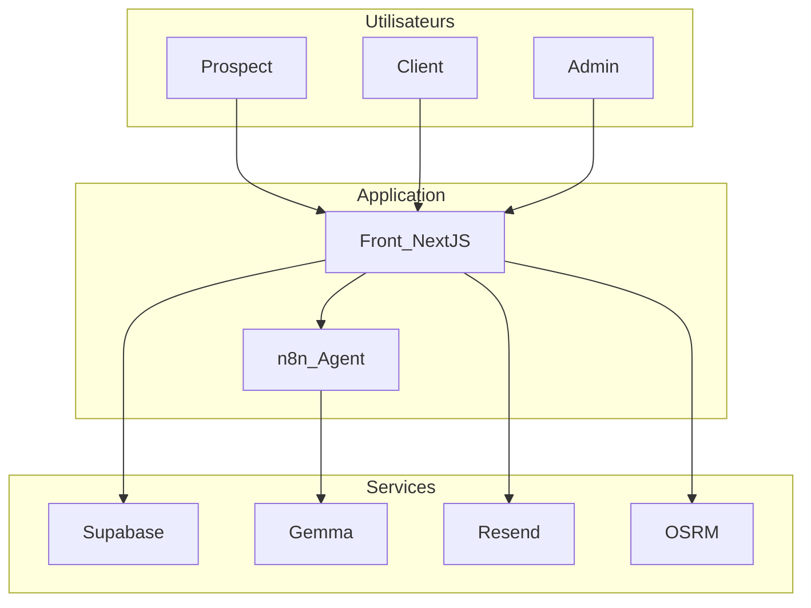
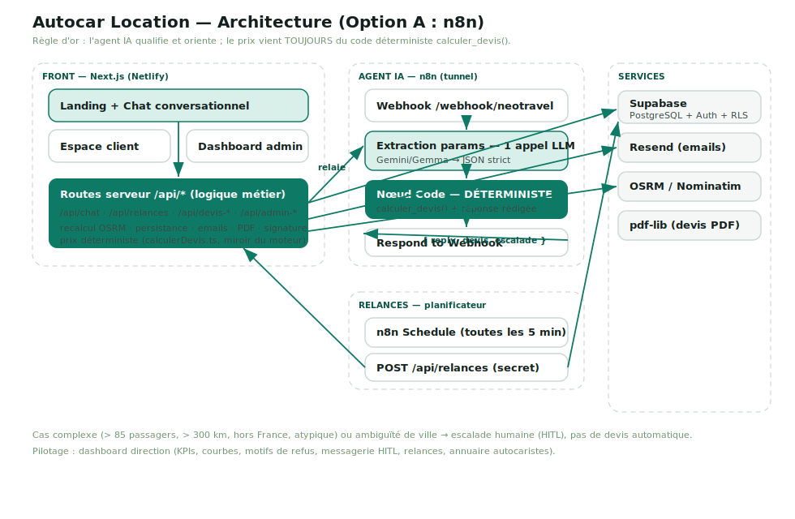
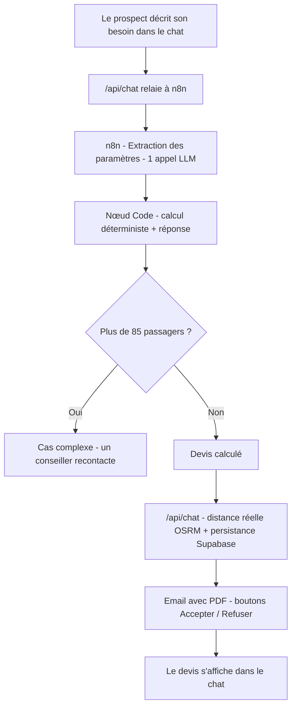
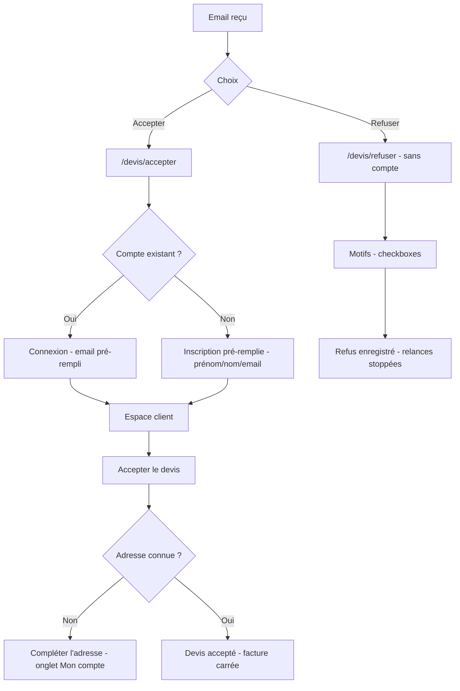
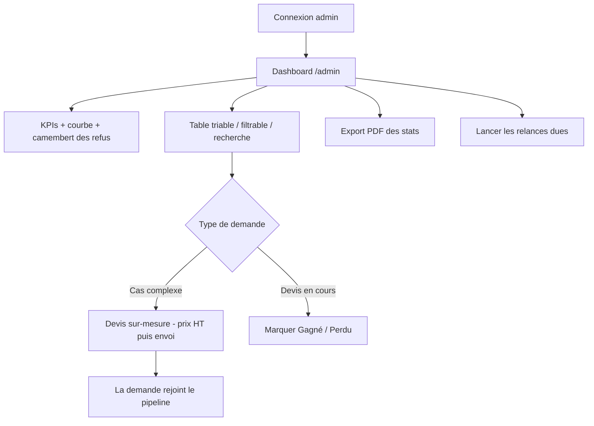
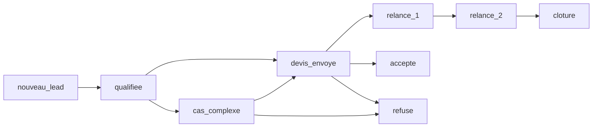

# Diagrammes — Autocar Location

Tous les schémas du projet au même endroit (Mermaid, rendus par GitHub / mermaid.live).
Pour le détail des tables, voir aussi **[supabase/SCHEMA.md](../supabase/SCHEMA.md)**.

---

## 1. Architecture générale

Qui parle à quoi. Le **front Next.js** (Netlify) est le centre : il sert les pages,
contient toute la logique métier (`/api/*`), appelle l'agent **n8n** (lui-même appelle
**Gemma**), récupère la **distance** (OSRM), et écrit dans **Supabase** + envoie les emails (**Resend**).

> Version image détaillée (routes, services, relances, HITL) : **[architecture.svg](architecture.svg)**.

---

## 2. Parcours PROSPECT — du chat au devis

L'agent ne fait **qu'un appel LLM** (extraction) ; le **prix et la réponse** sont
calculés/écrits par le nœud Code (déterministe). Au-delà de 85 passagers → cas complexe.

---

## 3. Parcours CLIENT — répondre à son devis

---

## 4. Parcours ADMIN — pilotage commercial

---

## 5. Cycle de vie d'une demande (statuts)

- **Automatique** : `nouveau_lead → … → relance_1 → relance_2 → cloture` (relances n8n).
- **Humain (HITL)** : `cas_complexe → devis sur-mesure → devis_envoye` ou `refuse`.
- **Issue** : `accepte` (gagné) / `refuse` / `cloture` (perdu).

---

## 6. Modèle de données

Diagramme complet (tables + colonnes + relations) dans **[supabase/SCHEMA.md](../supabase/SCHEMA.md)**.
