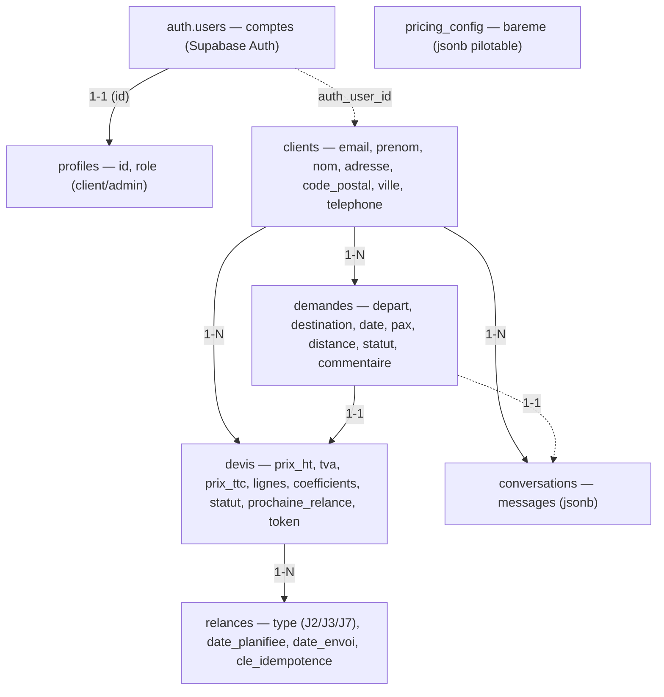

# Autocar Location — Modèle de données (Supabase / PostgreSQL)

Schéma relationnel sécurisé par **RLS** (Row Level Security) : un client ne voit que
ses données ; l'agent n8n et le dashboard admin passent par la **service role key**
(côté serveur). Diagramme en `flowchart` (tables + relations) :

## Tables

- **profiles** — relie un compte Auth à un rôle (`client` ou `admin`). Clé = `id` (= `auth.users.id`). Sert aux gardes de route et au filtrage RLS via la fonction `is_admin()`.
- **clients** — fiche client (coordonnées + **adresse de facturation** : `adresse`, `code_postal`, `ville`). Reliée à un compte Auth par `auth_user_id` (peut être nul : un lead existe avant d'avoir un compte). Email unique (insensible à la casse).
- **demandes** — une demande de transport : `depart`, `destination`, `date_depart`, `aller_retour`, `nb_passagers`, `distance_km`, `options`, `statut` (cycle de vie), `commentaire` (motif d'escalade pour les cas complexes).
- **devis** — devis chiffré rattaché à une demande : montants (`prix_ht`/`tva`/`prix_ttc`), `lignes` + `coefficients` (détail interne), `statut`, suivi des relances (`prochaine_relance`, `nb_relances`) et `token` (lien email « refuser sans compte »).
- **relances** — trace des relances envoyées (`type` J2/J3/J7, dates). `cle_idempotence` unique → empêche les doublons.
- **conversations** — historique du chat (`messages` en JSON), relié au client et éventuellement à la demande.
- **pricing_config** — barème de calcul (grille forfait, saison, capacité, marge, TVA) **pilotable** sans toucher au code (1 seule ligne).

## Relations

| De | Vers | Cardinalité | Clé |
|----|------|-------------|-----|
| auth.users | profiles | 1–1 | `profiles.id` |
| auth.users | clients | 0–1 | `clients.auth_user_id` |
| clients | demandes | 1–N | `demandes.client_id` |
| clients | devis | 1–N | `devis.client_id` (dénormalisé pour une RLS simple) |
| clients | conversations | 1–N | `conversations.client_id` |
| demandes | devis | 1–1 | `devis.demande_id` |
| demandes | conversations | 1–1 | `conversations.demande_id` |
| devis | relances | 1–N | `relances.devis_id` |

## Cycle de vie d'une demande (`statut`)

`nouveau_lead → incomplete → qualifiee → devis_envoye → relance_1 → relance_2 → (accepte | refuse | cloture)`
Branche humaine : `qualifiee → cas_complexe → (devis sur-mesure → devis_envoye | refuse)`.
