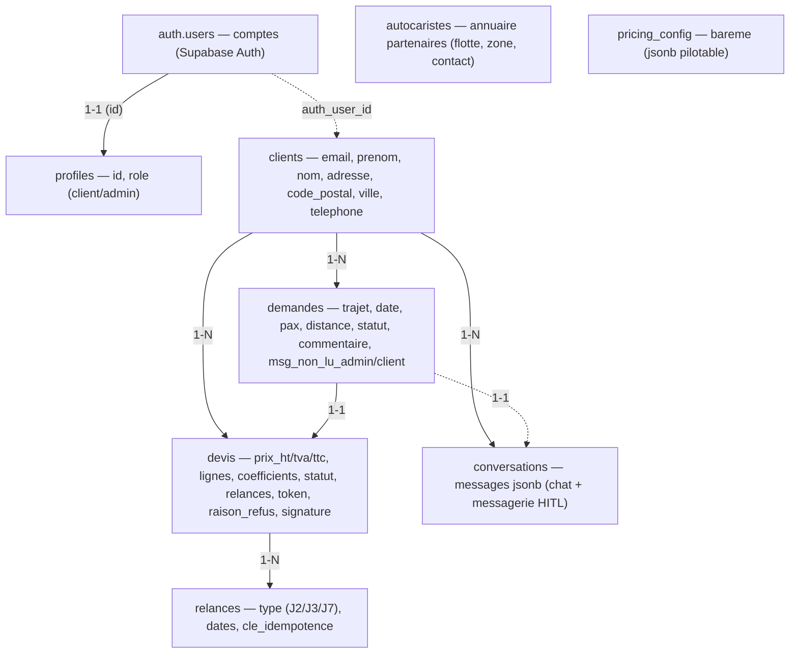
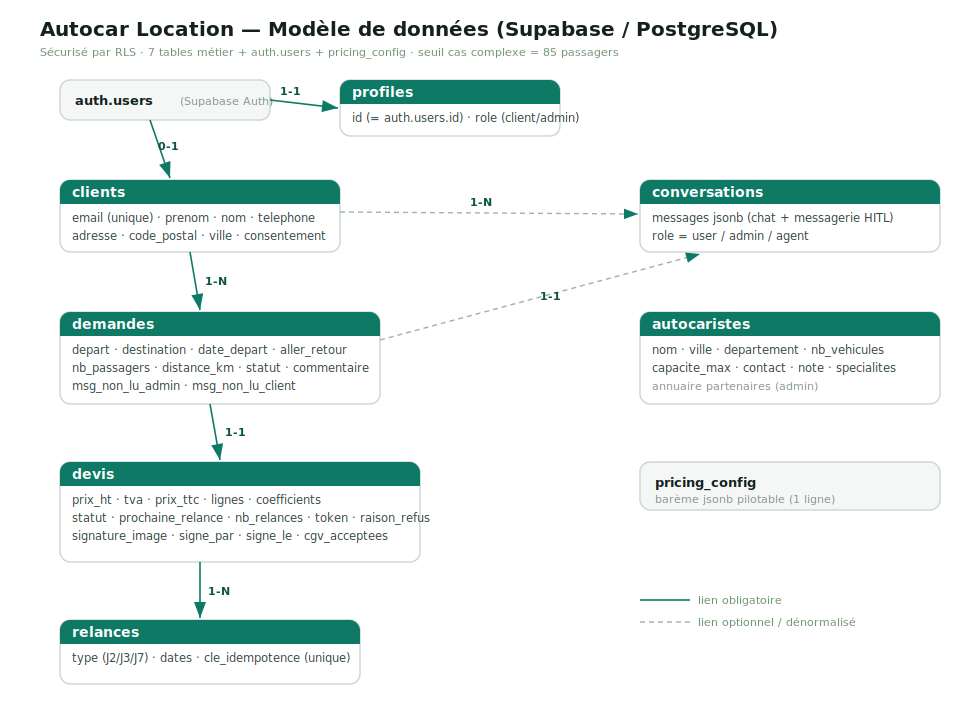

# Autocar Location — Modèle de données (Supabase / PostgreSQL)

Le socle de données repose sur PostgreSQL (Supabase) et est sécurisé par **RLS**
(Row Level Security) : un client ne voit que ses propres données, tandis que l'agent
n8n et le dashboard admin passent par la **service role key** côté serveur (qui
contourne RLS de façon contrôlée).

Le diagramme ci-dessous présente les tables et leurs relations. Les flèches pleines
sont des liens obligatoires (`1-N`, `1-1`) ; les flèches pointillées des liens
optionnels.

> Version image (utilisable hors GitHub / pour les livrables) : **[schema-bdd.svg](schema-bdd.svg)**.

## Tables

Chaque table porte une responsabilité unique ; le détail des colonnes utiles est
résumé ci-dessous.

- **profiles** — relie un compte Auth à un rôle (`client` ou `admin`). Clé = `id` (= `auth.users.id`). Sert aux gardes de route et au filtrage RLS via la fonction `is_admin()`.
- **clients** — fiche client (coordonnées + **adresse de facturation** : `adresse`, `code_postal`, `ville`). Reliée à un compte Auth par `auth_user_id` (peut être nul : un lead existe avant d'avoir un compte). Email unique (insensible à la casse).
- **demandes** — une demande de transport : `depart`, `destination`, `date_depart`, `aller_retour`, `nb_passagers`, `distance_km`, `options`, `statut` (cycle de vie), `commentaire` (motif d'escalade des cas complexes) et `msg_non_lu_admin` / `msg_non_lu_client` (drapeaux de la messagerie HITL bidirectionnelle).
- **devis** — devis chiffré rattaché à une demande : montants (`prix_ht`/`tva`/`prix_ttc`), `lignes` + `coefficients` (détail interne), `statut`, suivi des relances (`prochaine_relance`, `nb_relances`), `token` (lien email « refuser sans compte »), `raison_refus` (feedback du client) et la **signature électronique** d'acceptation (`signature_image`, `signe_par`, `signe_le`, `cgv_acceptees`).
- **relances** — trace des relances envoyées (`type` J2/J3/J7, dates). `cle_idempotence` unique → empêche les doublons.
- **conversations** — historique du chat **et** fil de messagerie HITL (`messages` en JSON : `role` = `user` / `admin` / `agent`), relié au client et à la demande.
- **autocaristes** — annuaire des transporteurs partenaires (données mock) : `nom`, `ville`, `departement`, `nb_vehicules`, `capacite_max`, `contact_email`, `contact_tel`, `note`, `specialites`, `actif`. Lecture réservée à l'admin (RLS).
- **pricing_config** — barème de calcul (grille forfait, saison, capacité, marge, TVA) **pilotable** sans toucher au code (1 seule ligne).

## Relations

Le tableau suivant récapitule les clés étrangères et leur cardinalité.

| De | Vers | Cardinalité | Clé |
|----|------|-------------|-----|
| auth.users | profiles | 1–1 | `profiles.id` |
| auth.users | clients | 0–1 | `clients.auth_user_id` |
| clients | demandes | 1–N | `demandes.client_id` |
| clients | devis | 1–N | `devis.client_id` (dénormalisé pour une RLS simple) |
| clients | conversations | 1–N | `conversations.client_id` |
| demandes | devis | 1–1 | `devis.demande_id` |
| demandes | conversations | 1–1 | `conversations.demande_id` |
| devis | relances | 1–N | `relances.devis_id` |

## Cycle de vie d'une demande (`statut`)

Le statut d'une demande suit le pipeline commercial, avec une branche humaine pour
les cas qui dépassent l'automatisable.

`nouveau_lead → incomplete → qualifiee → devis_envoye → relance_1 → relance_2 → (accepte | refuse | cloture)`

Branche humaine (HITL) : `qualifiee → cas_complexe → (devis sur-mesure → devis_envoye | refuse)`.
Le seuil d'escalade est de **85 passagers** ; un trajet
hors France bascule également en `cas_complexe`.
